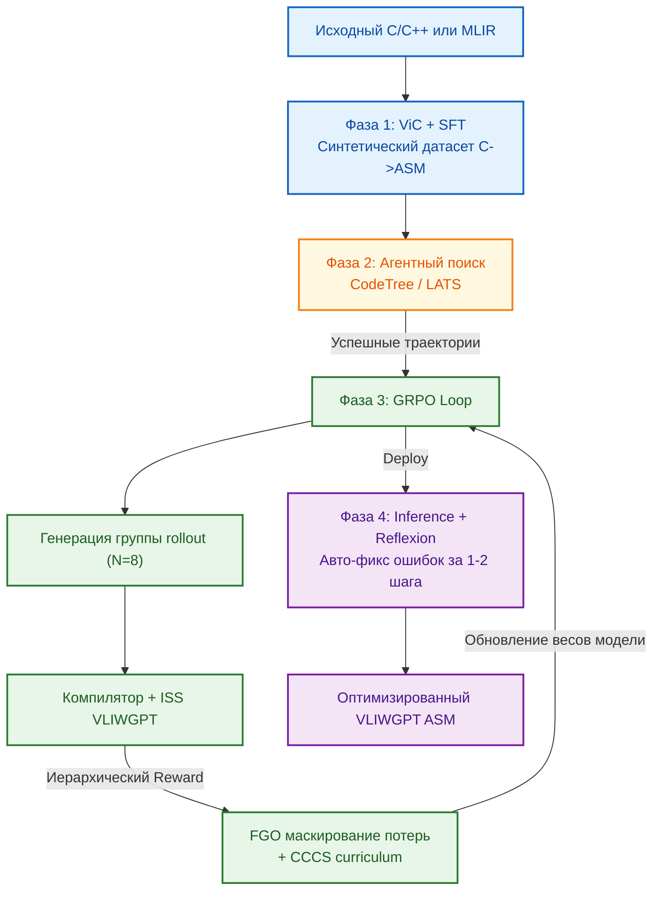

# 🧠 Генерация и супероптимизация ассемблера VLIWGPT: LLM, агенты и GRPO

## 🎯 Контекст: Почему авторегрессия не работает для VLIWGPT
Архитектура VLIWGPT делегирует выявление параллелизма на уровне инструкций (ILP) программному обеспечению. Жесткие аппаратные ограничения (фиксированные слоты ALU/MUL/LSU/BR, ограниченный регистровый файл, требования к выравниванию бандлов) делают традиционную авторегрессионную генерацию LLM неэффективной. Модель, обученная исключительно методами Supervised Fine-Tuning (SFT), неизбежно сталкивается с эффектом накопления ошибок: локально корректная инструкция в середине бандла может нарушить лимит портов загрузки или вызвать конфликт байпасинга, что приводит к некомпиллируемому листингу.

Решение лежит в переходе от статической генерации к **Environment-Driven Learning** — парадигме, где LLM выступает ядром самообучающегося агентного конвейера, получающего детерминированную обратную связь от компилятора и cycle-accurate симулятора (ISS). Это формирует основу для полной стратегии ко-эволюции программного стека совместно с аппаратными эпохами ChipGPT.

---

## 📈 Стратегия ко-эволюции SW/HW по эпохам ChipGPT
Эволюция ассемблера и компилятора синхронизирована с аппаратными переходами. На каждой эпохе LLM-агент обучается новым паттернам ISA, а GRPO-петля автоматически адаптирует стратегию планирования к расширенным ресурсам ядра.

| Эпоха ChipGPT | Аппаратный сдвиг | Эволюция SW/Компилятора | Фокус GRPO-обучения LLM |
|:---|:---|:---|:---|
| **I. Basic VLIW** | Статический планировщик, фиксированные FU, 2–8 issue | Базовый LLVM-бэкенд, генерация бандлов, SFT на синтетических парах C→ASM | `Compile@k`, `Execute@k`. Освоение грамматики слотов и регистрового аллокатора |
| **II. SIMD-VLIW** | Векторные расширения, предикатное исполнение | Паттерн-матчинг `linalg → vliw.simd_bundle`, генерация интринсиков `__builtin_vliwgpt_vec*` | Утилизация VALU, минимизация NOP при ветвлениях, предикатная супероптимизация |
| **III. Basic WARP** | Динамическое управление потоками, shared memory | Трансляция warp-контекста, управление барьерами `__syncwarp`, маппинг shared → local | Минимизация конфликтов банков памяти, перекрытие вычислений/загрузок (compute-memory overlap) |
| **IV. GPGPU/TPU** | Тензорные блоки, HBM, аппаратные планировщики | Интеграция с CUDA/MLIR, автогенерация тензорных бандлов, RAG-контекст новых протоколов | `Average Speedup`. Супероптимизация тайлинга, автоматический поиск скрытого ILP >8 |

**Ключевой принцип:** Компилятор, ISA и веса LLM эволюционируют в едином замкнутом цикле. Аппаратное расширение ISA автоматически генерирует новые `.td` описания, которые подаются в LLM как RAG-контекст, а GRPO-агент обучается их эффективному упаковке в бандлы.

### 💡 Почему это оптимально для ChipGPT
На Эпохе II базовое VLIW-ядро получает векторные расширения. Компилятор/LLM перестаёт генерировать скалярные цепочки `load → mul → add` и начинает формировать бандлы вида:
`[VALU: vfmadd8x_fp16] [VALU: vload_aligned] [BR: predicated jump]`
GRPO-петля оценивает такие бандлы по метрике `VALU_Utilization`, а не по IPC. Это даёт **кратный рост throughput** без увеличения ширины командного слова, так как один силлаб теперь выполняет работу 4–8 скалярных инструкций.

**VALU** (Vector Arithmetic Logic Unit) — это **векторное арифметико-логическое устройство**, специализированный исполнительный блок, который за один такт выполняет одну операцию над множеством данных (парадигма SIMD). 

В документации ChipGPT и спецификации VEX/VLIWGPT VALU описывается так:
> `Векторное АЛУ (VALU) | 6 слотов | Векторные арифметико-логические операции (8-широкие SIMD инструкции). Требуют выравнивания данных в векторных регистрах.`

| Параметр оптимизации | Что означает на практике |
|:---|:---|
| `Утилизация VALU` | Доля тактов, когда **все векторные lanes** заняты полезной работой. Если в бандле лежит `vadd` только для 2 из 8 элементов, утилизация = 25%. GRPO-агент учится упаковывать операции так, чтобы VALU не простаивал. |
| `Минимизация NOP при ветвлениях` | В VLIW ветвление (`if/else`) ломает линейный поток бандлов → компилятор вынужден вставлять пустые силлабы (NOP). VALU особенно чувствителен к этому, так как требует непрерывной подачи данных. |
| `Предикатная супероптимизация` | Вместо ветвлений используется **маскирование (predication)**. Инструкция выполняется для всех 8 элементов вектора, но результат записывается только там, где бит предиката = `1`. Это полностью устраняет NOP'ы и сохраняет утилизацию VALU на уровне >80%. |

---

## 🔄 Архитектура самообучающегося конвейера
Конвейер разбит на 4 фазы, обеспечивающих постепенное погружение модели в домен VLIWGPT:

1. **Синтетический Bootstrapping (ViC + SFT):** Виртуальный компилятор генерирует пары `C/C++ → VLIWGPT ASM`. LLM проходит SFT, усваивая мнемоники, форматы бандлов и базовый регистровый аллокатор.
2. **Накопление предпочтений (Tree Search):** Агентный поиск (CodeTree/LATS) исследует пространство планирования, сохраняя успешные траектории и тупики для RL-датасета.
3. **Автономное обучение с подкреплением (GRPO + FGO + CCCS):** Модель оптимизирует веса через относительное преимущество групп, игнорируя невыполненные токены при крахах (FGO) и постепенно усложняя задачи (CCCS).
4. **Адаптивное рефлексивное выполнение (Inference):** В продакшене легковесный агент-рефлектор анализирует ошибки компилятора и запрашивает коррекции у LLM за 1–2 итерации.

---

## 📊 GRPO и иерархическая система вознаграждений
Для масштабирования на крупные модели (Qwen-7B+) используется **Group Relative Policy Optimization (GRPO)**, исключающий тяжеловесную сеть оценки ценности (Value Network). Награда вычисляется исключительно на основе сравнения вариантов внутри одной группы генераций.

Для VLIWGPT внедрена **4-уровневая иерархическая функция вознаграждения**, предотвращающая оптимизацию синтаксически неверного кода:

| Уровень | Критерий | Верификатор | Логика начисления |
|:---|:---|:---|:---|
| **L1: Синтаксис** | Корректность бандлов, мнемоники, лимиты слотов | Парсер / LLVM Assembler | Бинарный фильтр. `0` при ошибке → следующие уровни не оцениваются |
| **L2: Исполнимость** | Отсутствие аппаратных исключений, валидный регистровый аллокатор | Cycle-Accurate ISS | Штраф за SEGFAULT/illegal op. Бонус за чистый `exit(0)` |
| **L3: Семантика** | Эквивалентность ввода/вывода C-эталону | MERASIC Diff-Fuzz | Пропорциональная награда за частичное совпадение результатов |
| **L4: Супероптимизация** | Минимизация тактов, заполнение слотов, bypass-эффективность | PMC счетчики ISS | `Reward = (Baseline_Cycles - Current_Cycles) / Baseline_Cycles` |

GRPO вычисляет нормализованное преимущество `A_i` внутри группы, обновляя политику так, чтобы LLM интуитивно улавливала разницу между "просто работающим" и "аппаратно оптимальным" кодом.

---

## 🌳 Поиск по дереву и тонкозернистая оптимизация (FGO)
Линейная генерация уязвима к накоплению ошибок: неудачное распределение регистров в начале функции делает невозможным успешное завершение. Конвейер решает это через **CodeTree / LATS**:

- **Refine:** Базовый блок успешно транслируется → генерируются дочерние узлы.
- **Abort:** Исчерпан регистровый файл или возник неизбежный простой конвейера → ветвь отсекается, система возвращается к родительскому узлу.
- **Accept:** Программа проходит ISS-валидацию → поиск останавливается.

Для устранения разреженности наград применяется **StepCoder FGO (Fine-Grained Optimization)**: если ISS крашится на такте 42 из 100, градиенты обновляются **только для токенов 1–42**. Токены после краша маскируются, что обеспечивает ювелирную точность обучения и предотвращает деградацию весов из-за непроверенного кода.

---

## 🛡️ Метрики верификации и интеграция с MERASIC
Оценка смещена с NLP-метрик (BLEU/ROUGE) на детерминированные критерии работоспособности кода в среде VLIWGPT:

| Метрика | Описание | Цель в ChipGPT |
|:---|:---|:---|
| `Compile-Success@k` | Вероятность ≥1 успешной компиляции из `k` сгенерированных вариантов | >95% к концу Epoch I |
| `Exec-Success@k` | Вероятность ≥1 выполнения без аппаратных исключений из `k` скомпилированных | >90% к Epoch II |
| `Functional-Correct@k` | Вероятность ≥1 прохождения 100% дифф-тестов MERASIC из `k` выполненных | >85% на всех эпохах |
| `Avg.Speedup@ISS` | `T_baseline / T_LLM` по тактам cycle-accurate ISS | >1.2x к Epoch III, >1.8x к Epoch IV |

💡 **Примечание:** `@k` означает оценку при `k` независимых генерациях одного промпта (типично `k=8..32`). Метрика отражает практическую полезность: *«Сколько попыток нужно, чтобы с высокой вероятностью получить рабочий код?»*

Метрики автоматически передаются в **MERASIC Oracle**, формируя скалярные `R_total` для GRPO и логируя паттерны супероптимизации в RAG-индекс для последующих поколений агентов.

---

## ✅ Итог: От LLM-генератора к автономному супероптимизатору
Интеграция LLM, агентных систем и GRPO превращает генерацию ассемблера VLIWGPT из ручного или эвристического процесса в детерминированный инженерный конвейер. Модель последовательно проходит путь от освоения синтаксиса (SFT) через исследование пространства планирования (CodeTree) к автономной супероптимизации (GRPO+FGO). 

Благодаря синхронизации с эпохами ChipGPT, программный стек эволюционирует параллельно с аппаратным: каждое новое расширение ISA (векторизация, warp-планирование, тензорные блоки) мгновенно становится частью обучающего пространства LLM. Это создает предпосылки для превосходства AI-компилятора над классическими эвристическими оптимизаторами, обеспечивая максимальную утилизацию конвейера VLIWGPT и детерминированный рост IPC на каждом шаге эволюции.