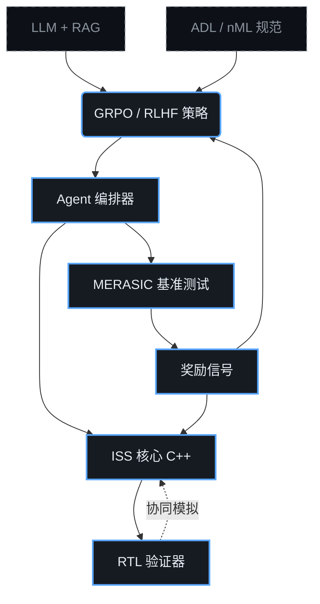

# 🧠 ChipGPT: 处理器架构的进化式 AI 设计

<picture>
  <source srcset="assets/banner.webp" type="image/webp">
  
</picture>

> 通过硬件/软件协同进化的闭环系统，从基础商用核心（VLIW/RISC-V）自动过渡到复杂的 GPU/TPU 加速器，并具备数学上可保证的正确性。

[](LICENSE)
[](https://www.python.org/downloads/)
[](https://isocpp.org/)
[](https://thechipgpt.github.io/chipgpt/)


## 1. 🎯 问题定义

现代 LLM 擅长生成高级代码，但在 RTL（Verilog 芯片代码）综合方面**却会出现严重错误**。原因在于：芯片设计是一个"零容错领域"。芯片逻辑或时序上的一个错误就意味着数亿美元成本的失效硅片，而不是像软件那样可以低成本热修复。

ChipGPT 解决三个根本性问题：
1. **缺乏自动化的架构搜索空间。** 典型的 ASIP 处理器核心生成流程需要手动选择 ISA 扩展和微架构参数。
2. **硬件与软件之间的鸿沟。** 没有编译器、汇编器和运行时环境的同步进化，核心的进化是无意义的。
3. **缺乏数学上可证明的验证闭环。** 生成模型缺乏内置的即时功能正确性检查机制。

我们引入了**进化式硬件/软件协同设计**，每次迭代都通过周期精确的模拟器（ISS）和 MERASIC 自我评估系统进行严格的形式化控制。

📖 *了解更多：* [芯片进化设计范式](#/wiki/evolutionary-paradigm) | [DSE vs 进化：对比分析](#/wiki/dse-vs-evolution)

---

## 2. 📐 系统架构



该系统将线性的 `设计空间探索（DSE）` 替换为**带有闭环验证的进化周期**：生成 → 模拟 → 评估 → 选择 → 变异/交叉 → 新时代。

---

## 3. 🧬 处理器核心进化的时代

从 **VLIW 到 GPU** 的进化分为 4 个质量上不同的时代。每个时代都意味着**三个层面的同步进化**：核心架构、汇编器/ISA 以及优化编译器。
每个时代可以由多个中间子时代组成。

| 时代 | 架构转变 | 关键变化 |
|:------|:-------------------|:-------------------|
| **I** | 基础 VLIW | 静态调度器、固定功能单元、简单寄存器文件 |
| **II** | SIMD-VLIW | 向量扩展、谓词执行、扩展数据总线 |
| **III** | 基础 WARP | 动态线程管理、共享内存、基础缓存一致性 |
| **IV** | GPGPU / TPU | 大规模并行、张量单元、硬件 warp 调度器、HBM 接口 |

时代之间的过渡仅在 MERASIC 功能正确性达到 `>99.99%` 且 IPC 增长 `≥1.8x` 时触发。

---

## 4. 📊 MERASIC：基准测试与自我评估系统

**MERASIC**（**M**icroarchitectural **E**valuation & **R**easoning for **A**I **Si**licon **C**o-design）—— 基础设施层，将芯片生成从概率性赌博转变为工程化流程。

### 为什么 LLM 无法直接处理 RTL？
- 无法跟踪并行状态（流水线、重排序缓冲区）
- 生成语法正确但功能错误的代码
- 缺乏内置的即时检查机制

### MERASIC 如何工作？
1. **生成 ISS** → 在标准测试上验证 → 获得数学上正确的参考模型。
2. **ISS 作为 Oracle** → 用于验证生成的 Verilog/SystemVerilog。
3. **评估指标：** 功能覆盖率、IPC、能效（估算）、代码密度、编译成功率。
4. **错误自动分类：** 逻辑错误、时序错误、资源错误、ISA 不匹配。

MERASIC 不仅仅是"测试 AI"。它为 **GRPO 提供奖励信号**，并确保结果的可复现性。

我们测试的链路是：**LLM（生成器）→ EDA 工具（编译器）→ ISS 模型（裁判/参考）**。输入是文本规范。输出是经过验证的 RTL、JSON 架构和推理追踪。模型不仅学会"生成代码"，还学会做出工程决策并通过模拟证明其正确性。

---

## 5. ⚙️ ISS：进化系统的核心

**ISS（指令集模拟器）** — 用 C++17 编写的真实芯片的 100% 功能等价物。实现周期精确的流水线、内存、总线和同步机制模拟。

### ISS 在 ChipGPT 中的三个角色：
| 角色 | 描述 |
|:-----|:---------|
| 🎯 **Ground Truth** | 用于 GRPO/RLHF 奖励函数计算的参考模型 |
| 🔍 **Golden Reference** | 用于比较 RTL 实现的数学 Oracle（协同模拟） |
| 🔄 **Evolving Core** | 在每个时代动态更新（例如 VLIW → SIMD-VLIW） |

ISS 设计为插件架构：新的 ISA、内存控制器和调度器通过统一 API 接入，无需重新编译模拟器核心。

---

## 6. 🧱 基础处理器核心

进化从经过商业验证和学术记录的结构开始：

| 核心 | 类型 | 来源 | 在进化中的角色 |
|:-----|:----|:---------|:----------------|
| `r-VEX` | VLIW | 开源 / HP 遗留代码 | 时代 I 的种子，进化的基础核心 |
| `RV32I_Min` | RISC-V | RISC-V 基金会 | 替代起点，关注 ISA 可扩展性 |
| `Custom ADL Spec` | nML/ArchDL | ChipGPT DSL | ADL-Agent 的形式化描述 |

基础核心包含完整的工具链（GCC/LLVM 后端、汇编器、链接器、性能分析器），这些也将随进化而更新。

---

## 7. 🤖 GRPO 训练

为了模拟架构思维，模型使用 **Group Relative Policy Optimization（GRPO）** 进行训练——这是 RLHF 的一个变体，针对具有组归一化奖励的离散解空间进行了优化。

### 训练内容：
| 流 | 目标 | 奖励信号 |
|:------|:------|:--------------|
| `6.1 编译器` | 自动生成优化后端 | 编译成功率、二进制大小、执行速度 |
| `6.2 汇编器/ISA` | 生成助记符和指令格式 | MERASIC 覆盖率、解码正确性、ADL 兼容性 |
| `6.3 架构` | 微架构进化 | IPC、流水线延迟、能耗估算、形式正确性 |

模型通过 RAG 索引持续吸收新的架构模式（Tensor Cores、Systolic Arrays、Mesh NoC），并形成可验证的假设。

---

## 8. 📚 RAG 助手

RAG（检索增强生成）作为**上下文记忆和专家系统**，引导进化方向。

### 8.1 RAG 作为上下文来源
在生成新架构时，LLM 检索相关模式：
- 现代 GPU 中寄存器文件访问模式示例
- RISC-V V / ARM SVE 中向量扩展的实现
- 缓存一致性和总线协议模式（AXI、TileLink）

### 8.2 RAG 作为代码评估器
并行代理使用 RAG 进行静态和语义检查：
- 识别 Verilog/SystemVerilog 中的反模式
- 检查编码和命名标准的符合性
- 与开源 IP 块的最佳实践进行比较

📖 *了解更多：* [RAG 在进化设计中的应用：从理论到实践](#/wiki/rag-chip-design)

---

## 9. 🕳️ 代理式生成方法

系统分为两个互补的代理，在闭环中协同工作：

| 代理 | 技术 | 任务 | 保证 |
|:------|:-----------|:--------|:---------|
| **ADL-Agent** | 形式化 ADL/nML + CodeGen | 从 ISA 规范生成 ISS、编译器、汇编器 | 100% 语义正确性、确定性 |
| **LLM+EA-Agent** | LLM + 进化算法 | 搜索最优拓扑、缓存参数、流水线深度、同步策略 | 创造性、在非形式化空间中的优化 |

**交互方式：** ADL-Agent 创建形式化基础。LLM+EA-Agent 生成架构变体种群。MERASIC 进行评估。GRPO 更新策略。循环持续直到达到时代目标指标。

📖 *了解更多：* [代理式处理器设计：ADL + LLM + EA](#/wiki/agent-pipeline)

---

## 🚀 Quick Start

```bash
# 1. 克隆仓库
git clone https://github.com/thechipgpt/chipgpt.git && cd chipgpt

# 2. 安装依赖（Python + C++）
pip install -r requirements.txt
./scripts/setup_cxx_deps.sh

# 3. 下载基础模型和 GRPO 权重
./scripts/download_models.sh

# 4. 启动第一个进化时代（VLIW → SIMD-VLIW）
python chipgpt/evolve.py --epoch 1 --base-core rvex --benchmarks merasic_v1
```

